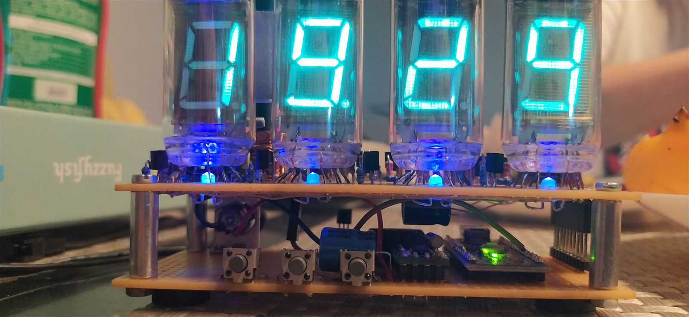
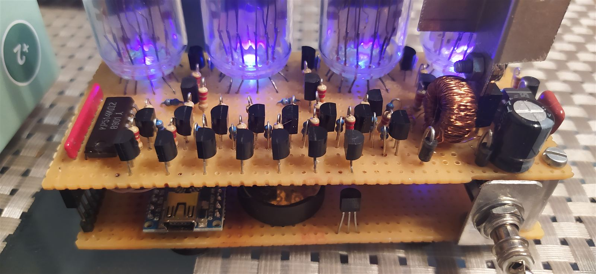
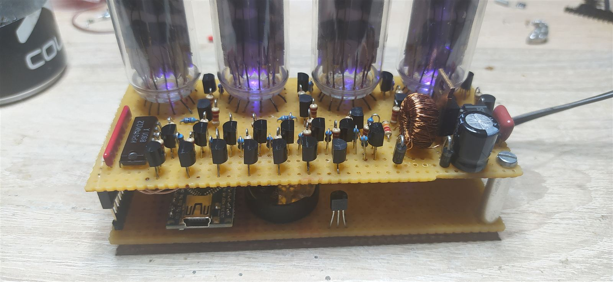
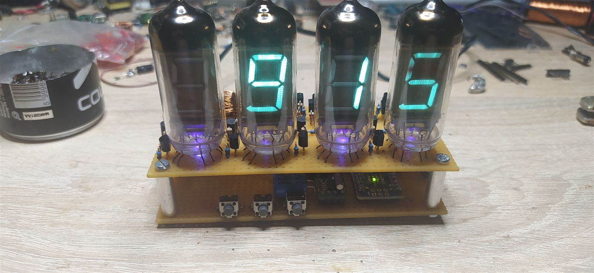
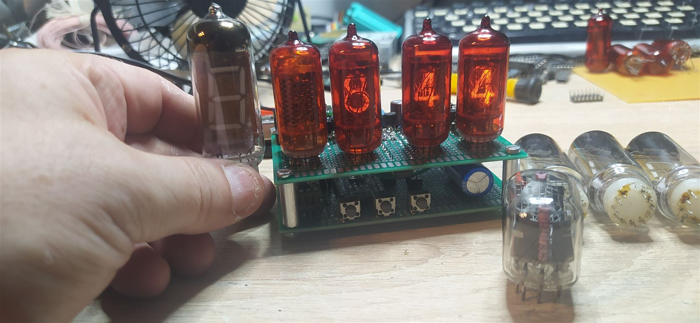
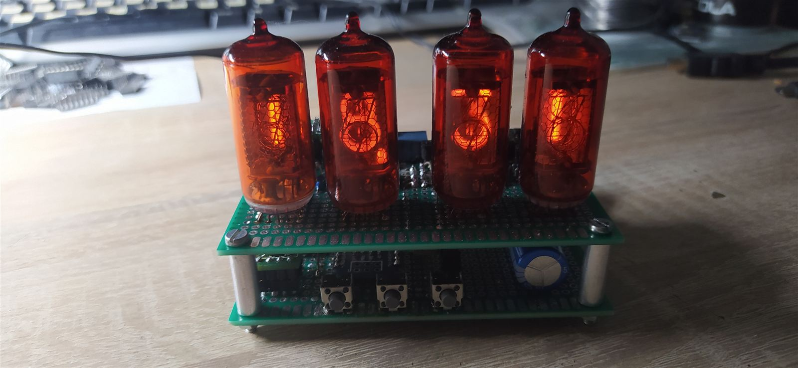

# Universal Nixie / VFD Clock

A simple 4-tube Nixie or VFD clock built around an Arduino Nano — no GPS, no 32-bit MCU, no exotic high-side drivers. Just an RTC chip, a temperature sensor, and a BCD decoder driving the tubes.

## Why this exists

Every "simple" Nixie/VFD clock project I could find online was either wildly overkill (GPS sync, 32-bit MCUs) or relied on exotic parts (high-side drivers) — or just had mistakes in the design. This is my attempt at an actually simple version, built with parts I had on hand. Even the Arduino Nano is arguably overkill for this job, but it's a reasonable convenience trade-off.

The clock displays HH:MM on 4 tubes (Nixie or VFD, same driving scheme), with a seconds indicator LED, and can show temperature on demand from a DS18B20 sensor.

## Hardware

- Arduino Nano
- RTC chip — either variant works, pick the matching firmware:
  - **M41T81(S)** (I2C, address `0x68`)
  - **PCF8583** (I2C, address `0x50`)
- DS18B20 temperature sensor (OneWire)
- Nixie driver: **K511ID1** (BCD-to-Nixie driver with built-in high voltage output). A 74141/74155 could be substituted for a simpler, lower-voltage design — see notes in [Schematics](Schematics/).
- 4x Nixie or VFD tubes (same BCD interface either way)
- 3 push buttons (hours / minutes / show temperature); a 4th optional button (seconds display) is supported by the PCF8583 firmware variant
- 1 status LED (seconds indicator)

### Pinout (Arduino Nano)

| Signal | Pin |
|---|---|
| RTC / temp sensor I2C SDA | `A4` |
| RTC / temp sensor I2C SCL | `A5` |
| DS18B20 OneWire bus | `D3` |
| Button 1 — set hours | `A3` |
| Button 2 — set minutes | `A2` |
| Button 3 — show temperature | `A1` |
| Button 4 — show seconds *(PCF8583 variant only)* | `A0` |
| Tube 1 select | `D7` |
| Tube 2 select | `D4` |
| Tube 3 select | `D5` |
| Tube 4 select | `D6` |
| BCD bit 0 | `D8` |
| BCD bit 1 | `D9` |
| BCD bit 2 | `D10` |
| BCD bit 3 | `D11` |
| Seconds indicator LED | `D2` |

Full schematics (both Nixie and VFD versions) are in [`Schematics/`](Schematics/) as KiCad `.sch` source and exported PDFs.

## Firmware

Two firmware variants live in [`Code/`](Code/), depending on which RTC chip your board uses:

| File | RTC chip | Notes |
|---|---|---|
| `DigClock_v0.3.ino` | M41T81(S) | Base version |
| `DigClock_v0.3_8583.ino` | PCF8583 | Adds an optional 4th button to display seconds |

Both implement a basic 24-hour clock:
- The RTC is polled 10 times/second into a display buffer.
- A `TIMER1` overflow ISR runs at 200 Hz, refreshing one tube at a time (dynamic multiplexing) — each tube is refreshed at 50 Hz with a 25% duty cycle.
- The three buttons set hours, set minutes, and momentarily show temperature (read from the DS18B20).

The RTC driver code is adapted (not a proper library dependency) from dr4nc3s's M41T81S Arduino library, since it wasn't installable as-is in this project's environment. Temperature reading uses Matias Munk Jansen's [DS18B20 library](https://github.com/matmunk/DS18B20).

## Building one

1. Wire up per the pinout table / schematics for your chosen tube type (Nixie or VFD) and RTC chip.
2. Flash the `.ino` matching your RTC chip via the Arduino IDE.
3. Set the time with buttons 1/2 (hours/minutes); hold button 3 to check temperature.

## Gallery

| | |
|---|---|
|  |  |
|  |  |
|  |  |

## License

[MIT](LICENSE)
